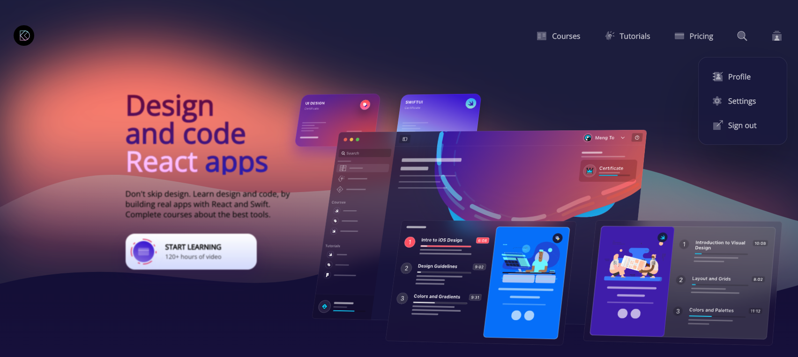

This is a little website develop with React template called Gatsby 

                   ====================
                  \       GATSBY        \
                   \=====================\

Gatsby is the fast and flexible framework that makes building websites with 
any CMS, API, or database fun again. Build and deploy headless websites that 
drive more traffic, convert better, and earn more revenue!

All information can be found at: www.gatsbyjs.com
1 - Create a new site

    npm install -g gatsby-cli
    npm init gatsby
    cd my-gatsby-site
    npm run develop
    Gatsby will start a hot-reloading development environment accessible by default 
    at http://localhost:8000

Flags are not positional, so these commands are equivalent:

    npm init gatsby -y -ts my-site-name
    npm init gatsby my-site-name -y -ts

Project Folder Structure
   
    gatsby-config: Where we have all code related to the site title and description.
    src: is where al the file opf the project will live such as components, pages
          Layout.css: global css
          Layout.js: for the main page of the project.
          SEO: Settings related configuration for sharing.
    pages: index.js: main entry point of the app.
    Assets: for all the static files such as images....

2 - Other installation

    Nodejs
    npm styled-components: A way of organizing your css

3 - Building the application

    Css Configuration
         Css reset: Reboot, Resets and reasonning: css-tricks.com
         replace the basic on with the code inside of the layout css file
    Purchase Button

4- Build GATSBY projects for deployment

    1- gatsby clean
    1- gatsby build

